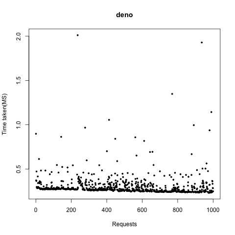
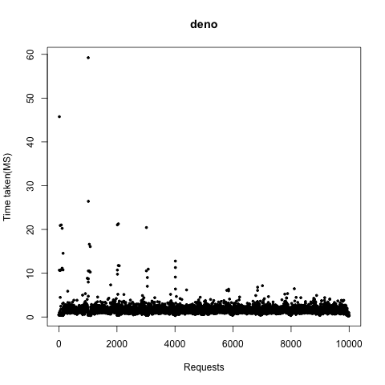
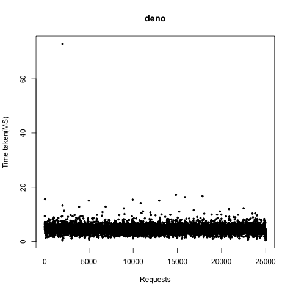
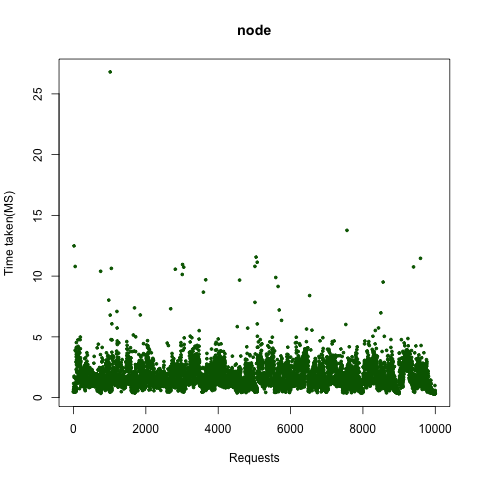
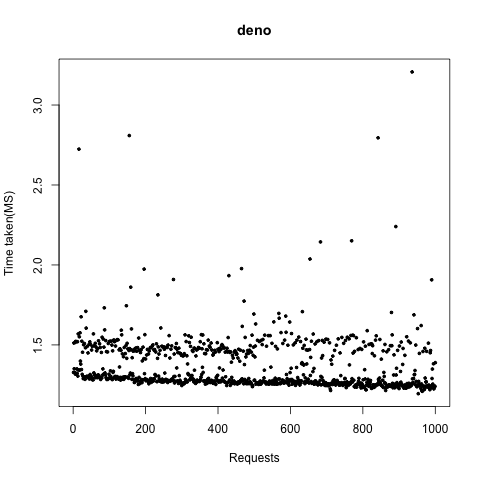
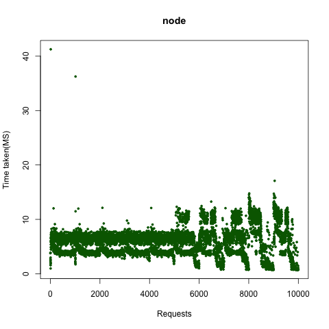

# Performance Comparison of Deno and Node.js on over 30+ tests

## Introduction

Deno is a simple, modern, and secure runtime for JavaScript and TypeScript. Deno is sandboxed and supports Typescript out of the box.Deno is built over Google's V8 engine and uses Rust. The first major release of Deno was launched in May 2020.

Node.js is a very popular battle-tested runtime for Javascript. Node.js has been around for more than 11 years. Node.js is built over Google's V8 engine and uses C++.

Functionally, Deno is same as Node.js. 

Now onwards, there would always be two options to choose from: Node.js or Deno?

It is very unlikely that existing Node.js apps will be ported to Deno.
But it is very likely that people **could** consider Deno for new apps.

If both are functionally same, what are the primary factors to consider Deno over Node.js:
* Reliability
* Performance
* (could be more ....)

Reliability would be discussed separately. The focus of this page is performance.

So, is Deno ready for prime time? Can it perform as good as or better as Node.js?
If Deno can't perform as good as Node.js, it can never become a major runtime.

The purpose of this repository/page is to continually run and report 30+ on tests to compare Deno's performance against Node.js. The plan is to keep this repository/page updated as soon as there are new releases on either Deno or Node.js. The frequency would likely be weekly.

Finally, it's worth mentioning that, only readings would be presented. Coming to a conclusion is upto the reader.

```Work is still in progress```


### Versions
Deno: ```1.5.1```
Node.js: ```15.1.0```
### Environment
MacBook Pro 1.4Ghz Quad core i5 with 8G memory

### List of Tests

| Test | Description |
| ------- | ------- |
| ```Hello world!``` | This one is a very simple hello world program. It responds to a GET request with a JSON containing a string Hello World! |  
| ```Hello world with frameworks - oak and express``` | Hello world program using the popular frameworks: Oak/Deno, Express/Node.js |  
| ```Echo name over HTTPS``` | A simple echo name program that runs over HTTPS |  
| ```Five hundred random integers``` | Generate five hundred random integers and return them in a JSON array |  
| ```Five hundred random 16 character hex string``` | Generate five hundred random 16 character hex strings and return them in a JSON array |  
| ```One hundred V1 UUIDs``` | Generate one hundred V1 UUIDs and return them in a JSON array |  
| ```One hundred V4 UUIDs``` | Generate one hundred V4 UUIDs and return them in a JSON array |  
| ```One hundred V5 UUIDs``` | Generate one hundred V5 UUIDs and return them in a JSON array |  
| ```Parse five hundred strings``` | Parse five hundred strings containing integers and return parsed integers in a JSON array |  
| ```Calculate mean of 500 numbers``` | Calculate mean of 500 numbers and return it in response |  
| ```Calculate median of 500 numbers``` | Calculate median of 500 numbers and return it in response |  

## Tests and Results


### Hello world!
This one is a very simple hello world program. It responds to a GET request with a JSON containing a string Hello World!
* [Deno Code](https://github.com/mayankchoubey/deno-vs-nodejs/blob/master/deno_hello_world.ts)
* [Node Code](https://github.com/mayankchoubey/deno-vs-nodejs/blob/master/node_hello_world.js)
#### Concurrency=1
Total requests: ```1000```


| Reading | Node.js | Deno |
| ------- | ------- | ---- |
| TimeTakenMS | ```527``` | ```566``` | 
| Mean | ```0.31``` | ```0.32``` | 
| Median | ```0.00``` | ```0.00``` | 
| Min | ```0``` | ```0``` | 
| Max | ```19``` | ```11``` | 





Deno is ```6.89%``` slower than  Node.js
#### Concurrency=10
Total requests: ```10000```


| Reading | Node.js | Deno |
| ------- | ------- | ---- |
| TimeTakenMS | ```1646``` | ```1576``` | 
| Mean | ```1.06``` | ```1.07``` | 
| Median | ```1.00``` | ```1.00``` | 
| Min | ```0``` | ```0``` | 
| Max | ```20``` | ```17``` | 


Deno is ```4.25%``` faster than  Node.js
#### Concurrency=25
Total requests: ```25000```


| Reading | Node.js | Deno |
| ------- | ------- | ---- |
| TimeTakenMS | ```4141``` | ```3687``` | 
| Mean | ```3.13``` | ```2.48``` | 
| Median | ```3.00``` | ```2.00``` | 
| Min | ```0``` | ```0``` | 
| Max | ```41``` | ```37``` | 


Deno is ```10.96%``` faster than  Node.js

### Hello world with frameworks - oak and express
Hello world program using the popular frameworks: Oak/Deno, Express/Node.js
* [Deno Code](https://github.com/mayankchoubey/deno-vs-nodejs/blob/master/deno_hello_world_oak_exp.ts)
* [Node Code](https://github.com/mayankchoubey/deno-vs-nodejs/blob/master/node_hello_world_oak_exp.js)
#### Concurrency=1
Total requests: ```1000```


| Reading | Node.js | Deno |
| ------- | ------- | ---- |
| TimeTakenMS | ```656``` | ```582``` | 
| Mean | ```0.44``` | ```0.38``` | 
| Median | ```0.00``` | ```0.00``` | 
| Min | ```0``` | ```0``` | 
| Max | ```13``` | ```10``` | 


Deno is ```11.28%``` faster than  Node.js
#### Concurrency=10
Total requests: ```10000```


| Reading | Node.js | Deno |
| ------- | ------- | ---- |
| TimeTakenMS | ```2280``` | ```1734``` | 
| Mean | ```1.79``` | ```1.20``` | 
| Median | ```2.00``` | ```1.00``` | 
| Min | ```0``` | ```0``` | 
| Max | ```22``` | ```16``` | 


Deno is ```23.95%``` faster than  Node.js
#### Concurrency=25
Total requests: ```25000```


| Reading | Node.js | Deno |
| ------- | ------- | ---- |
| TimeTakenMS | ```5385``` | ```3978``` | 
| Mean | ```4.67``` | ```2.76``` | 
| Median | ```4.00``` | ```3.00``` | 
| Min | ```0``` | ```1``` | 
| Max | ```43``` | ```34``` | 


Deno is ```26.13%``` faster than  Node.js

### Echo name over HTTPS
A simple echo name program that runs over HTTPS
* [Deno Code](https://github.com/mayankchoubey/deno-vs-nodejs/blob/master/deno_https_hello_name.ts)
* [Node Code](https://github.com/mayankchoubey/deno-vs-nodejs/blob/master/node_https_hello_name.js)
#### Concurrency=1
Total requests: ```1000```


| Reading | Node.js | Deno |
| ------- | ------- | ---- |
| TimeTakenMS | ```699``` | ```688``` | 
| Mean | ```0.44``` | ```0.47``` | 
| Median | ```0.00``` | ```0.00``` | 
| Min | ```0``` | ```0``` | 
| Max | ```20``` | ```15``` | 


Deno is ```1.57%``` faster than  Node.js
#### Concurrency=10
Total requests: ```10000```


| Reading | Node.js | Deno |
| ------- | ------- | ---- |
| TimeTakenMS | ```1923``` | ```1915``` | 
| Mean | ```1.39``` | ```1.43``` | 
| Median | ```1.00``` | ```1.00``` | 
| Min | ```0``` | ```0``` | 
| Max | ```34``` | ```37``` | 


Deno is ```0.42%``` faster than  Node.js
#### Concurrency=25
Total requests: ```25000```


| Reading | Node.js | Deno |
| ------- | ------- | ---- |
| TimeTakenMS | ```4763``` | ```4465``` | 
| Mean | ```3.88``` | ```3.39``` | 
| Median | ```4.00``` | ```3.00``` | 
| Min | ```0``` | ```0``` | 
| Max | ```79``` | ```102``` | 


Deno is ```6.26%``` faster than  Node.js

### Five hundred random integers
Generate five hundred random integers and return them in a JSON array
* [Deno Code](https://github.com/mayankchoubey/deno-vs-nodejs/blob/master/deno_random_int.ts)
* [Node Code](https://github.com/mayankchoubey/deno-vs-nodejs/blob/master/node_random_int.js)
#### Concurrency=1
Total requests: ```1000```


| Reading | Node.js | Deno |
| ------- | ------- | ---- |
| TimeTakenMS | ```854``` | ```938``` | 
| Mean | ```0.42``` | ```0.49``` | 
| Median | ```0.00``` | ```0.00``` | 
| Min | ```0``` | ```0``` | 
| Max | ```11``` | ```9``` | 


Deno is ```8.96%``` slower than  Node.js
#### Concurrency=10
Total requests: ```10000```


| Reading | Node.js | Deno |
| ------- | ------- | ---- |
| TimeTakenMS | ```2395``` | ```2496``` | 
| Mean | ```1.57``` | ```1.60``` | 
| Median | ```1.00``` | ```2.00``` | 
| Min | ```0``` | ```0``` | 
| Max | ```22``` | ```19``` | 





Deno is ```4.05%``` slower than  Node.js
#### Concurrency=25
Total requests: ```25000```


| Reading | Node.js | Deno |
| ------- | ------- | ---- |
| TimeTakenMS | ```6112``` | ```5982``` | 
| Mean | ```4.84``` | ```3.88``` | 
| Median | ```4.00``` | ```4.00``` | 
| Min | ```0``` | ```0``` | 
| Max | ```48``` | ```52``` | 





Deno is ```2.13%``` faster than  Node.js

### Five hundred random 16 character hex string
Generate five hundred random 16 character hex strings and return them in a JSON array
* [Deno Code](https://github.com/mayankchoubey/deno-vs-nodejs/blob/master/deno_random_hex.ts)
* [Node Code](https://github.com/mayankchoubey/deno-vs-nodejs/blob/master/node_random_hex.js)
#### Concurrency=1
Total requests: ```1000```


| Reading | Node.js | Deno |
| ------- | ------- | ---- |
| TimeTakenMS | ```2220``` | ```2423``` | 
| Mean | ```1.06``` | ```1.14``` | 
| Median | ```1.00``` | ```1.00``` | 
| Min | ```0``` | ```0``` | 
| Max | ```15``` | ```12``` | 


Deno is ```8.38%``` slower than  Node.js
#### Concurrency=10
Total requests: ```10000```


| Reading | Node.js | Deno |
| ------- | ------- | ---- |
| TimeTakenMS | ```6043``` | ```8421``` | 
| Mean | ```4.33``` | ```5.14``` | 
| Median | ```3.00``` | ```5.00``` | 
| Min | ```0``` | ```1``` | 
| Max | ```33``` | ```38``` | 


Deno is ```28.24%``` slower than  Node.js
#### Concurrency=25
Total requests: ```25000```


| Reading | Node.js | Deno |
| ------- | ------- | ---- |
| TimeTakenMS | ```16104``` | ```22393``` | 
| Mean | ```13.77``` | ```15.57``` | 
| Median | ```12.00``` | ```16.00``` | 
| Min | ```0``` | ```4``` | 
| Max | ```68``` | ```112``` | 


Deno is ```28.08%``` slower than  Node.js

### One hundred V1 UUIDs
Generate one hundred V1 UUIDs and return them in a JSON array
* [Deno Code](https://github.com/mayankchoubey/deno-vs-nodejs/blob/master/deno_uuid_v1.ts)
* [Node Code](https://github.com/mayankchoubey/deno-vs-nodejs/blob/master/node_uuid_v1.js)
#### Concurrency=1
Total requests: ```1000```


| Reading | Node.js | Deno |
| ------- | ------- | ---- |
| TimeTakenMS | ```1078``` | ```1464``` | 
| Mean | ```0.47``` | ```0.78``` | 
| Median | ```0.00``` | ```1.00``` | 
| Min | ```0``` | ```0``` | 
| Max | ```14``` | ```11``` | 


Deno is ```26.37%``` slower than  Node.js
#### Concurrency=10
Total requests: ```10000```


| Reading | Node.js | Deno |
| ------- | ------- | ---- |
| TimeTakenMS | ```2924``` | ```3728``` | 
| Mean | ```1.98``` | ```2.75``` | 
| Median | ```2.00``` | ```3.00``` | 
| Min | ```0``` | ```0``` | 
| Max | ```26``` | ```33``` | 




Deno is ```21.57%``` slower than  Node.js
#### Concurrency=25
Total requests: ```25000```


| Reading | Node.js | Deno |
| ------- | ------- | ---- |
| TimeTakenMS | ```7690``` | ```10508``` | 
| Mean | ```6.12``` | ```8.80``` | 
| Median | ```6.00``` | ```9.00``` | 
| Min | ```0``` | ```1``` | 
| Max | ```54``` | ```110``` | 


Deno is ```26.82%``` slower than  Node.js

### One hundred V4 UUIDs
Generate one hundred V4 UUIDs and return them in a JSON array
* [Deno Code](https://github.com/mayankchoubey/deno-vs-nodejs/blob/master/deno_uuid_v4.ts)
* [Node Code](https://github.com/mayankchoubey/deno-vs-nodejs/blob/master/node_uuid_v4.js)
#### Concurrency=1
Total requests: ```1000```


| Reading | Node.js | Deno |
| ------- | ------- | ---- |
| TimeTakenMS | ```1477``` | ```2386``` | 
| Mean | ```0.87``` | ```1.74``` | 
| Median | ```1.00``` | ```2.00``` | 
| Min | ```0``` | ```1``` | 
| Max | ```12``` | ```11``` | 


Deno is ```38.10%``` slower than  Node.js
#### Concurrency=10
Total requests: ```10000```


| Reading | Node.js | Deno |
| ------- | ------- | ---- |
| TimeTakenMS | ```4671``` | ```12201``` | 
| Mean | ```3.72``` | ```11.14``` | 
| Median | ```3.00``` | ```10.00``` | 
| Min | ```0``` | ```2``` | 
| Max | ```28``` | ```62``` | 


Deno is ```61.72%``` slower than  Node.js
#### Concurrency=25
Total requests: ```25000```


| Reading | Node.js | Deno |
| ------- | ------- | ---- |
| TimeTakenMS | ```11581``` | ```34289``` | 
| Mean | ```9.95``` | ```32.51``` | 
| Median | ```9.00``` | ```30.00``` | 
| Min | ```0``` | ```2``` | 
| Max | ```58``` | ```257``` | 


Deno is ```66.23%``` slower than  Node.js

### One hundred V5 UUIDs
Generate one hundred V5 UUIDs and return them in a JSON array
* [Deno Code](https://github.com/mayankchoubey/deno-vs-nodejs/blob/master/deno_uuid_v5.ts)
* [Node Code](https://github.com/mayankchoubey/deno-vs-nodejs/blob/master/node_uuid_v5.js)
#### Concurrency=1
Total requests: ```1000```


| Reading | Node.js | Deno |
| ------- | ------- | ---- |
| TimeTakenMS | ```1716``` | ```2311``` | 
| Mean | ```1.09``` | ```1.64``` | 
| Median | ```1.00``` | ```2.00``` | 
| Min | ```0``` | ```1``` | 
| Max | ```15``` | ```25``` | 





Deno is ```25.75%``` slower than  Node.js
#### Concurrency=10
Total requests: ```10000```


| Reading | Node.js | Deno |
| ------- | ------- | ---- |
| TimeTakenMS | ```6629``` | ```9793``` | 
| Mean | ```5.42``` | ```8.76``` | 
| Median | ```5.00``` | ```9.00``` | 
| Min | ```0``` | ```1``` | 
| Max | ```32``` | ```75``` | 




Deno is ```32.31%``` slower than  Node.js
#### Concurrency=25
Total requests: ```25000```


| Reading | Node.js | Deno |
| ------- | ------- | ---- |
| TimeTakenMS | ```15671``` | ```28780``` | 
| Mean | ```14.21``` | ```27.08``` | 
| Median | ```14.00``` | ```27.00``` | 
| Min | ```0``` | ```3``` | 
| Max | ```77``` | ```241``` | 


Deno is ```45.55%``` slower than  Node.js

### Parse five hundred strings
Parse five hundred strings containing integers and return parsed integers in a JSON array
* [Deno Code](https://github.com/mayankchoubey/deno-vs-nodejs/blob/master/deno_parse_int.ts)
* [Node Code](https://github.com/mayankchoubey/deno-vs-nodejs/blob/master/node_parse_int.js)
#### Concurrency=1
Total requests: ```1000```


| Reading | Node.js | Deno |
| ------- | ------- | ---- |
| TimeTakenMS | ```960``` | ```1149``` | 
| Mean | ```0.55``` | ```0.64``` | 
| Median | ```1.00``` | ```1.00``` | 
| Min | ```0``` | ```0``` | 
| Max | ```13``` | ```8``` | 


Deno is ```16.45%``` slower than  Node.js
#### Concurrency=10
Total requests: ```10000```


| Reading | Node.js | Deno |
| ------- | ------- | ---- |
| TimeTakenMS | ```2525``` | ```2854``` | 
| Mean | ```1.74``` | ```1.88``` | 
| Median | ```2.00``` | ```2.00``` | 
| Min | ```0``` | ```0``` | 
| Max | ```25``` | ```22``` | 


Deno is ```11.53%``` slower than  Node.js
#### Concurrency=25
Total requests: ```25000```


| Reading | Node.js | Deno |
| ------- | ------- | ---- |
| TimeTakenMS | ```6055``` | ```7055``` | 
| Mean | ```4.78``` | ```5.03``` | 
| Median | ```4.00``` | ```5.00``` | 
| Min | ```0``` | ```1``` | 
| Max | ```46``` | ```47``` | 


Deno is ```14.17%``` slower than  Node.js

### Calculate mean of 500 numbers
Calculate mean of 500 numbers and return it in response
* [Deno Code](https://github.com/mayankchoubey/deno-vs-nodejs/blob/master/deno_mean.ts)
* [Node Code](https://github.com/mayankchoubey/deno-vs-nodejs/blob/master/node_mean.js)
#### Concurrency=1
Total requests: ```1000```


| Reading | Node.js | Deno |
| ------- | ------- | ---- |
| TimeTakenMS | ```615``` | ```639``` | 
| Mean | ```0.40``` | ```0.44``` | 
| Median | ```0.00``` | ```0.00``` | 
| Min | ```0``` | ```0``` | 
| Max | ```11``` | ```10``` | 


Deno is ```3.76%``` slower than  Node.js
#### Concurrency=10
Total requests: ```10000```


| Reading | Node.js | Deno |
| ------- | ------- | ---- |
| TimeTakenMS | ```1870``` | ```1921``` | 
| Mean | ```1.30``` | ```1.41``` | 
| Median | ```1.00``` | ```1.00``` | 
| Min | ```0``` | ```0``` | 
| Max | ```21``` | ```18``` | 


Deno is ```2.65%``` slower than  Node.js
#### Concurrency=25
Total requests: ```25000```


| Reading | Node.js | Deno |
| ------- | ------- | ---- |
| TimeTakenMS | ```4438``` | ```4494``` | 
| Mean | ```3.50``` | ```3.30``` | 
| Median | ```3.00``` | ```3.00``` | 
| Min | ```0``` | ```0``` | 
| Max | ```41``` | ```41``` | 


Deno is ```1.25%``` slower than  Node.js

### Calculate median of 500 numbers
Calculate median of 500 numbers and return it in response
* [Deno Code](https://github.com/mayankchoubey/deno-vs-nodejs/blob/master/deno_median.ts)
* [Node Code](https://github.com/mayankchoubey/deno-vs-nodejs/blob/master/node_median.js)
#### Concurrency=1
Total requests: ```1000```


| Reading | Node.js | Deno |
| ------- | ------- | ---- |
| TimeTakenMS | ```725``` | ```698``` | 
| Mean | ```0.51``` | ```0.49``` | 
| Median | ```0.00``` | ```0.00``` | 
| Min | ```0``` | ```0``` | 
| Max | ```11``` | ```9``` | 


Deno is ```3.72%``` faster than  Node.js
#### Concurrency=10
Total requests: ```10000```


| Reading | Node.js | Deno |
| ------- | ------- | ---- |
| TimeTakenMS | ```2240``` | ```2285``` | 
| Mean | ```1.78``` | ```1.83``` | 
| Median | ```2.00``` | ```2.00``` | 
| Min | ```0``` | ```0``` | 
| Max | ```23``` | ```20``` | 


Deno is ```1.97%``` slower than  Node.js
#### Concurrency=25
Total requests: ```25000```


| Reading | Node.js | Deno |
| ------- | ------- | ---- |
| TimeTakenMS | ```5551``` | ```6524``` | 
| Mean | ```4.67``` | ```5.65``` | 
| Median | ```4.00``` | ```6.00``` | 
| Min | ```0``` | ```1``` | 
| Max | ```44``` | ```47``` | 


Deno is ```14.91%``` slower than  Node.js
## Scenarios to be added

Following is the list of scenarios that would be added soon:
* Logger: console, file
* Api proxy: http, https
* JSON cloning: small and large
* Websocket
* File operations: create, write, delete
* TCP server
* UDP server
* Environment variables: get, set and delete
* Base64: text, image
* MD5, shal1,sha256, sha512, sha3
* Big JSON upload
* Multipart form data
* Image, PDF upload
* Workers
* Regexes
* Luhn check

## Next steps

There is a lot more work to be done! If you like to suggest more benchmarks, please add an issue with your suggestions.

Also, please add a star to this repository if it has been valuable. More stars means more readers and this would encourage us to keep the benchmarking running.